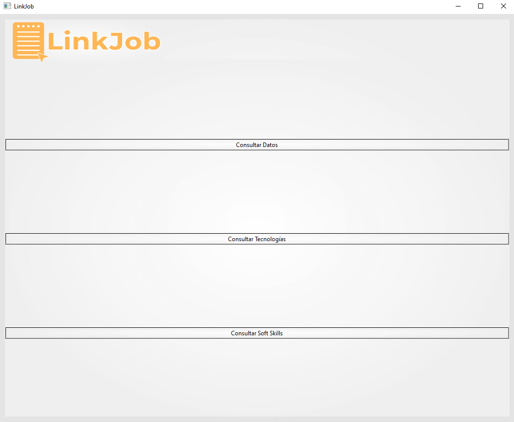
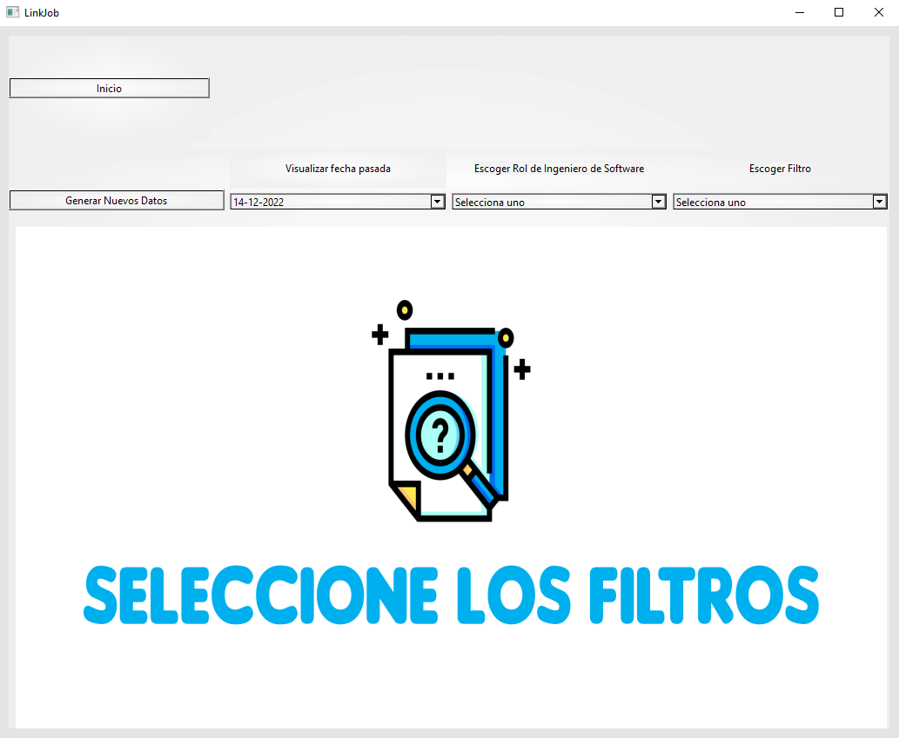
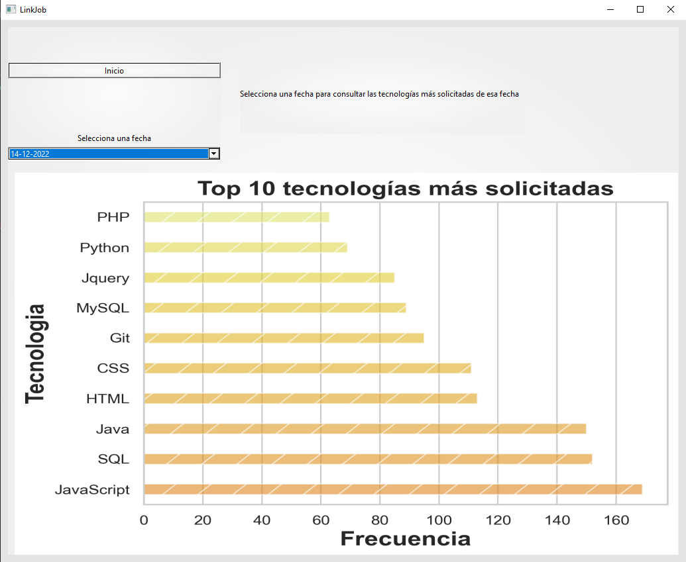

# 
> LinkJob es una aplicación que permite visualizar la información acerca de las ofertas de trabajo para ingenieros de software en México en el sitio web de Glassdoor, por medio de gráficas.
> - Video demo: [aquí](https://alumnosuady-my.sharepoint.com/:v:/g/personal/a18000577_alumnos_uady_mx/EfhrNFqTem5JqrC46uENK7QBUHue_zFiCpK1TtcFPiNctQ?e=nGAApF) <!-- If you have the project hosted somewhere, include the link here. -->

## Tabla de Contenidos
* [Información General](#información-general)
* [Tecnologías Usadas](#tecnologías-usadas)
* [Funcionalidades](#funcionalidades)
* [Screenshots](#screenshots)
* [Setup](#setup)
* [Estado del Proyecto](#estado-del-proyecto)
* [Espacio para Mejora](#espacio-para-mejora)
* [Agradecimientos](#agradecimientos)
* [Contacto](#contacto)
<!-- * [License](#license) -->

## Información General
- Este proyecto fue realizado para la asignatura Programación Orientada a Objetos.
- Existe una falta de información sobre las ofertas de empleo para Ingenieros de Software en México, no hay una manera clara y visual de tener la información acerca del mercado para este puesto.
- Esta segunda revisión es la continuación al desarrollo de la misma aplicación durante Enero-Mayo 2022. Decidimos continuar con el proyecto con un diseño orientado a objetos totalizando un año de desarrollo total.
- El resultado final de este período Agosto-Diciembre 2022 se encuentra en este repositorio. Para consultar el proceso, sprints al igual que bitácoras [referir a este repositorio.](https://github.com/CarlosMay7/POO---Equipo-2)
- Esperamos que nuestro proyecto sea de utilidad para los estudiantes de Ingeniería de Software en México, y sea herramienta para informarse acerca de la situación actual del mercado, salarios, lugares de alta demanda, tecnologías solicitadas, softskills y otra información útil para su elección.
- Como actuales estudiantes de Ingeniería de Software, queríamos acceder a esta información, y al no estar disponible, decidimos solucionar esta problemática.

## Tecnologías Usadas
- Python - version 3
- Pandas - version 1.5.2
- Selenium - version 4.1.5
- PySide6 - version 6.4.1
- Nltk - version 3.7
- Scikit-learn - version 1.1.3
- Seaborn - 0.12.1
- QT Designer
- Chromedriver Webdriver

## Funcionalidades
Lista de las funcionalidades:
- Recolección (Webscrapping) de los distintos elementos del sitio Glassdoor.
- Limpieza (Parsing) de la información recolectada a información manejable, útil y compacta, donde se convierten en objetos guardados en el sistema.
- Modelado (Plotting) de una lista de objetos en forma de gráfica de barras, con escalas, etiquetas del total y valor individual de las gráficas, exportación a un archivo .png
- Análisis sentimental de las descripciones de trabajo de ingenieros de software, para identificar los roles de Ingenieros de Software a los que se apega la oferta.
- Interfaz gráfica con botones dropdown dinámicos que permiten visualizar una gráfica dependiendo de la información solicitada y presente. Esta llama a las funciones anteriores y muestra el .png exportado

## Screenshots

## Setup

Es necesario instalar las [librerías de python](#tecnologías-usadas) mencionadas anteriormente.

Se requiere el chromedriver webdriver para la version de chrome que se tenga instalado. 

- [Chromedriver](https://chromedriver.chromium.org/downloads)

Cuando se tengan todas las piezas de la [carpeta 'GIU'](https://github.com/EliasMaDeRe/LinkJob/tree/Revision-2/GUI) de este repositorio, solo es necesario correr el archivo 'main.py'

`main.py`

Las graficas son cargadas de las guardadas en el sistema y se le da al usuario una opción en la interfaz para generar nuevos datos.

## Estado del Proyecto
El proyecto está:  _completado_. 

## Espacio para Mejora

Estas son áreas que consideramos pueden tener mejora y cosas que nos hubiese gustado implementar pero no se pudieron realizar por cuestión de tiempo y viabilidad.

Espacio para mejorar:

- Almacenado local. El sistema podría tener la opción de consumir una base de datos en la nube.
- Modularidad de front-end y back-end del sistema. Actualmente se usa python para ambas, pero un desplegarla en forma web podría representar ventaja de portabilidad.
- Mayor precisión del análisis sentimental. Se podrían cargar más datasets preverificados para hacer el análisis sentimental más preciso.

## Agradecimientos

Este proyecto fue realizado por: 
- [Fernando Joachín Prieto](https://github.com/FernandoJoachin)
- [José Carlos Leo Fernandez](https://github.com/JoCaLeFe)
- [Elías Madera De Regil](https://github.com/EliasMaDeRe/LinkJob)
- [Carlos Augusto May Vivas](https://github.com/CarlosMay7)
- [Reyna Valentina Ortiz Porras](https://github.com/valeeortiz)

Este proyecto fue originalmente inspirado por [este artículo de Omer Sakarya](https://mersakarya.medium.com/selenium-tutorial-scraping-glassdoor-com-in-10-minutes-3d0915c6d905), y [este video por Ken Jee](https://www.youtube.com/watch?v=MpF9HENQjDo). Esta [guía por datacamp](https://www.datacamp.com/tutorial/text-analytics-beginners-nltk) que nos sirvió como introducción a machine learning.

Un agradecimiento especial al [Dr. Edgar Cambranes](https://twitter.com/cambranes), por su mentoría durante la realización de este proyecto.

## Contacto

Siéntanse libres de mandarnos mensaje a través de correo byemadera@gmail.com.
