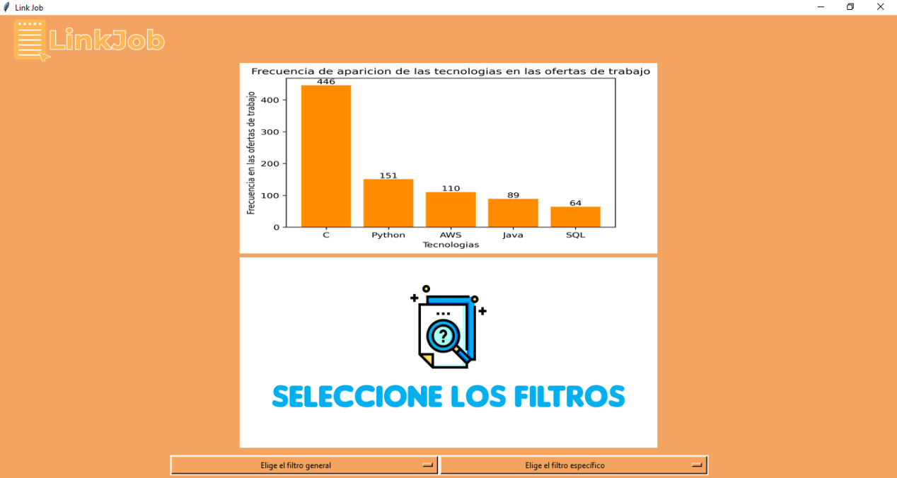
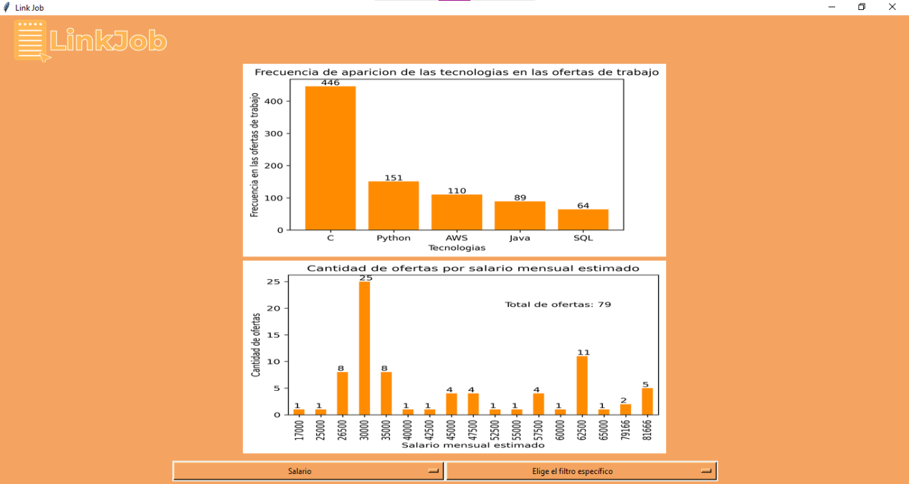

# LinkJob 
> LinkJob es una aplicación que proporciona información sobre las ofertas de trabajo para ingenieros de software en México en forma de gráficas y archivos .csv
> - Video demo: [aquí](https://alumnosuady-my.sharepoint.com/personal/a18000621_alumnos_uady_mx/_layouts/15/onedrive.aspx?id=%2Fpersonal%2Fa18000621%5Falumnos%5Fuady%5Fmx%2FDocuments%2F2022%2D05%2D23%2022%2D02%2D02%2Emp4&parent=%2Fpersonal%2Fa18000621%5Falumnos%5Fuady%5Fmx%2FDocuments&ga=1) <!-- If you have the project hosted somewhere, include the link here. -->

## Tabla de contenidos
* [Información general](#información-general)
* [Tecnologías usadas](#tecnologías-usadas)
* [Funcionalidades](#funcionalidades)
* [Screenshots](#screenshots)
* [Setup](#setup)
* [Usabilidad](#usabilidad)
* [Estado del proyecto](#estado-del-proyecto)
* [Espacio para mejora](#espacio-para-mejora)
* [Agradecimientos](#agradecimientos)
* [Contacto](#contacto)
<!-- * [License](#license) -->

## Información general
- Aplicación como resultado del proyecto para la materia Programación Estructurada.
- Existe un vacío en la información fácilmente disponible sobre las ofertas de empleo para ingenieros de software en México, no hay una manera clara y visual de tener la información acerca de el mercado para este puesto.
- Esperamos que este proyecto ayude a los estudiantes de ingniería de software en México a estar más informados acerca de la situación actual del mercado, salarios, lugares de alta demanda, tecnologías solicitadas y otra información útil.
- Como actuales estudiantes de ingeniería de software, queríamos acceder a esta información, y al no estár disponible, decidimos hacer nuestra propia solución.

## Tecnologías usadas
- Python - version 3.9.7
- Pandas - version 1.3.6
- Selenium - version 4.1.5
- matplotlib - version 3.4.3
- tkinter 
- chromedriver webdriver

## Funcionalidades
Lista de las funcionalidades listas:
- Webscraping de el sitio Glassdoor, exportación de la información recabada en un archivo .csv
- Parsing de la información en un archivo .csv a información manejable, útil y compacta, exportación a un archivo .csv
- Plotteo de un archivo .csv en forma de gráfica de barras, con escalas, etiquetas del total y valor individual de las gráficas, exportación a un archivo .png
- Interfaz gráfica con botones dropdown que permiten solicitar una gráfica en particular, llaman a las funciones anteriores y muestra el .png exportado

## Screenshots

## Setup
El proyecto funciona a base del codigo incluído en la carpet acódigo.

Es necesario instalar las librerías de python arriba mencionadas.

Para el proyecto, se puede descargar el archivo 'glassdoor_jobs.csv' como archivo .csv a usar para el programa (contiene información de Abril/2022)
En caso de querer actualizar el archivo .csv, hay que descomentar una función (documentada dentro del archivo) en 'exportardatos.py' de llamada al webscrapping. Adicional a esto, se requiere el chromedriver webdriver para la version de chrome que se tenga instalado. 

- [Chromedriver](https://chromedriver.chromium.org/downloads)

Después de descomentar, el programa exportará un archivo .csv actualizado llamado 'glassdoor_jobs.csv', después de esto, se puede volver a comentar la línea para solo cargar el archivo ya exportado con la información nueva. 

Todas las gráficas son generadas al momento con la información de ese archivo.

## Usabilidad

Como se mencionó anteriormente, el programa ya cuenta con información precargada de Abril/2022 para puestos de ingeniería de software en México, sin embargo, de querer actualizar esta información, se seguirían los pasos en el punto de arriba, para realizar el proceso de webscraping en Glasdoor de nuevo.

Cuando se tengan todas las piezas de la carpeta 'codigo' de este repositorio, es solo necesario correr el script o archivo 'interfaz.py'

`interfaz.py`

## Estado del proyecto
El proyecto está:  _completado_ . 

Aunque el proyecto está finalizado, la información es fácil de mantener relevante, por lo que no descartamos trabajar con él en un futuro como proyecto de alguna otra materia.

## Espacio para mejora

Estas son áreas que consideramos pueden tener mejora y cosas que nos hubiese gustado implementar pero no se pudieron realizar por cuestión de tiempo y viabilidad.

Espacio para mejorar:
- Mejorar la interfaz. (Realizar cambios en resolución de las gráficas, usabilidad de la interfaz)
- Mensajes explicativos para los casos cuando no se encuentra información en los datos. (Actualmente solo es un output en consola de ejecución)

Para realizar:
- Opción de archivar las gráficas por intervalo de tiempo. (Por ejemplo, poder consultar las gráficas de meses/años anteriores)
- Mayor cantidad de filtros. (Por ejemplo, añadir a filtros específicos las locaciones encontradas)

## Agradecimientos

Este proyecto fue realizado por: 
- [Fernando Joachín Prieto](https://github.com/FernandoJoachin)
- [José Carlos Leo Fernandez](https://github.com/JoCaLeFe)
- [Elías Madera De Regil](https://github.com/EliasMaDeRe/LinkJob)
- [Carlos Augusto May Vivas](https://github.com/CarlosMay7)
- [Reyna Valentina Ortiz Porras](https://github.com/valeeortiz)

Este proyecto fue inspirado por [este artículo de Omer Sakarya](https://mersakarya.medium.com/selenium-tutorial-scraping-glassdoor-com-in-10-minutes-3d0915c6d905), y [este video por Ken Jee](https://www.youtube.com/watch?v=MpF9HENQjDo).

Un agradecimiento especial al [Dr. Edgar Cambranes](https://twitter.com/cambranes), por su mentoría durante la realización de este proyecto.

## Contacto

Siéntanse libres de mandarnos mensaje a través de correo byemadera@gmail.com .
